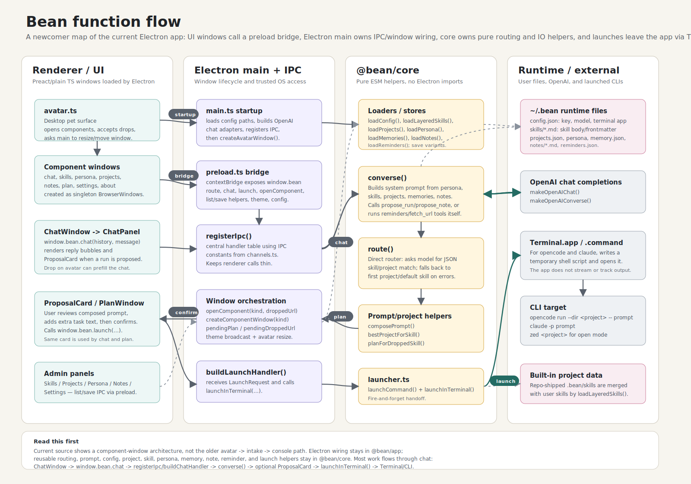

# Bean

<div align="center">
  
</div>

A personal harness that lives on your desktop as a tiny pet. Day to day it's just a
chat app that remembers things about you. When something needs real work — a project,
or just life — it grows into a launcher that hands the task to a coding agent
(`opencode`/`claude` in Terminal, or your own editor), with your confirmation.

**macOS only, for now.** Bean is an `LSUIElement` menu-bar-less agent app built with
electron-builder's `--mac` target.


**_Note_**: The installer from the release panel is **NOT** generated by a real apple developer cert. 

Use your own account to sign it or use 

```xattr -dr com.apple.quarantine /Applications/Bean.app``` if you receive the ```This application is from an unidentified developer``` error.


## The concept

- **Starts as just a chat, with memory.** Talk to it like any chat app. It saves notes
  from the conversation and, on close, offers to extract durable facts about you or a
  project into long-term memory — so it actually gets to know you over time, not just
  within one session.
- **Grows into a harness for getting things done.** The same conversation can propose a
  *run*: a skill + a project + a composed prompt. Confirm it and Bean hands off to a real
  coding agent — `opencode`/`claude` in Terminal.app, or your configured editor —
  instead of trying to do the work itself. Skills are just markdown (built-in `.bean/skills/`, yours in
  `~/.bean/skills/`, yours wins), so growing the harness is writing a `.md` file, not code.
- **A bean, not a dashboard.** It sits on your desktop as a small always-on-top avatar.
  Hover → a box. Click → petals for chat/skills/projects/notes. Drag a URL onto it →
  it blooms into your skills instead, so you drop the link straight onto the one that
  should handle it.
- **Nothing runs without you confirming it.** Chat, drag-drop, and the skills panel all
  end at the same proposal card — skill, target project, composed prompt, editable —
  with an explicit **Confirm & run**. A skill can target `chat` (runs right there) or
  `terminal` (hands off to the external agent).
- **Fire-and-forget launches.** Once confirmed, Bean hands off to Terminal or your
  editor and stops watching — it's a harness for *starting* real work, not a wrapper
  around it.

## Requirements

- macOS
- Node ≥24, pnpm 11
- `opencode` and/or `claude` on your `PATH` (whichever launch modes you use)
- Your own OpenAI API key (BYOK) — Bean makes no model calls of its own, you set the key
  in the Settings panel

## Setup

Nothing to hand-edit — Bean bootstraps `~/.bean` on first launch and everything after
that is a UI panel: 
 - **Settings** for your OpenAI key (BYOK)/model/terminal/editor,
 - **Persona** to set your name, tastes, and other personal info,
 - **Skills** to add or edit a skill,
 - **Projects** to point at folders on disk. 
 - ...
 
Under the hood it's still just files (`~/.bean/config.json`, `skills/*.md`, `projects.json`) if
you ever want to sync or script them, but you never have to touch them directly.

## Develop

```bash
pnpm install
pnpm dev         # build core + app, then launch the app
pnpm test        # run all unit tests
pnpm typecheck   # tsc --noEmit in every package
pnpm dist:mac    # build a distributable .dmg/.zip
```

Monorepo: `packages/core` (pure routing/IO logic, zero Electron) + `packages/app`
(Electron shell, esbuild-bundled). See `AGENTS.md` for the full architecture.

Contributions from AI agents are welcome, but must follow `AGENTS.md` — in particular:
isolate every task in its own worktree (`pnpm worktree:create <branch>` /
`pnpm worktree:remove <branch>`, never commit on `main` directly), and have `codegraph`
installed and on your `PATH`, since worktree creation runs `codegraph init` automatically.

## Function flow



